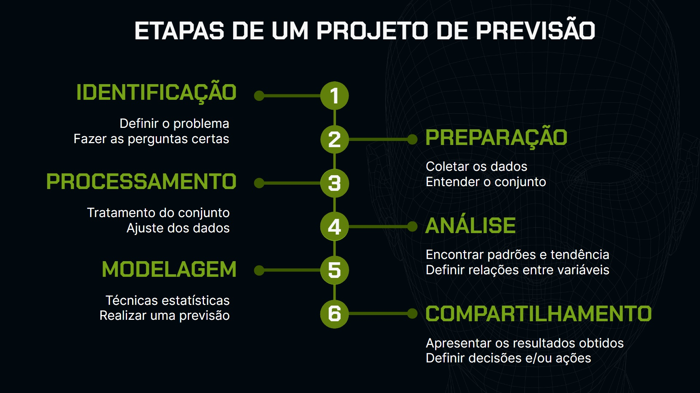

# 🚲 Previsão de Demanda para Sistemas de Bicicletas Compartilhadas

🐍 Python 📦 v1.0.0

Este projeto implementa um pipeline completo de Ciência de Dados para modelagem estatística, tratamento de séries temporais e previsão de demanda horária de aluguel de bicicletas, utilizando o algoritmo **Prophet** da Meta e visualizações dinâmicas com **Plotly** e **Seaborn**.

---

## 🔄 Pipeline de Desenvolvimento Metodológico

O projeto foi estruturado seguindo as 6 fases do ciclo de vida de projetos de dados para garantir reprodutibilidade e integridade analítica:

### 1. Identificação
* **Objetivo:** Prever as flutuações na contagem horária de locações para otimização de logística, balanceamento de frotas entre estações e planejamento de manutenção.
* **Hipótese de Negócio:** Identificação de que o serviço funciona predominantemente como modal de transporte corporativo/rotineiro (deslocamento obrigatório diário) e menos para atividades de lazer espontâneas.

### 2. Preparação
* **Ingestão:** Importação automatizada e diagnóstico estrutural da matriz inicial contendo 17.429 linhas e 10 variáveis qualitativas e quantitativas.
* **Mapeamento Categórico:** Inventário detalhado da cardinalidade das variáveis de calendário (`feriado`, `fim_de_semana`) e de ambiente (`clima`, `estacao`).

### 3. Processamento (Saneamento de Dados)
* **Tratamento de Redundâncias:** Isolamento de máscara booleana e exclusão definitiva de 15 registros gêmeos idênticos no final do dataset, mitigando riscos de *overfitting*.
* **Imputação de Lacunas:** Correção de 23 registros nulos (`NaN`) nas colunas térmicas por meio de **interpolação linear**, preservando a fluidez sequencial da série temporal meteorológica.
* **Ajuste Cronológico:** Conversão sistemática e alinhamento do vetor de strings para objetos nativos `datetime64[ns]`.

### 4. Análise Exploratória & Testes de Hipóteses
* **Dinâmica de Calendário:** Análise por boxplots revelando que as medianas centrais recuam drasticamente de **855.0 para 439.5** em feriados e de **927.0 para 619.0** em fins de semana.
* **Volumetria Climática:** Isolamento da dominância de climas favoráveis (`Céu limpo` com 7.14M e `Parcialmente nublado` com 6.96M) sobre cenários severos (`Neve` com 15k).

<p align="center">
  
  
</p>

* **Diagnóstico de Multicolinearidade:** Identificação de correlação linear perfeita de **0.99** entre `temperatura` real e `sensacao_termica` via mapas de calor.
* **Desempate Estatístico:** Aplicação do teste não-paramétrico bicaudal de **Mann-Whitney** entre as amostras de Primavera (mediana 823.0) e Outono (mediana 898.0). O resultado apontou um *p-valor* de **0.000476**, rejeitando a hipótese nula ($H_0$) e provando que as distribuições são estatisticamente distintas.

### 5. Modelagem Preditiva & Validação
* **Ajuste Univariado:** Estruturação da matriz nos padrões obrigatórios `ds` (*datestamp*) e `y` (*target*) com sanitização preventiva de timezones via `.dt.tz_localize(None)`.
* **Tratamento de Outliers e Otimização:** Calibração e remoção de valores discrepantes no histórico para estabilização de tendência do algoritmo Prophet.

### 6. Compartilhamento & Resultados
* **Métricas de Performance Finais:** 
  * **RMSE (Raiz do Erro Quadrático Médio):** Reduzido para **3.934,31 bicicletas**, demonstrando alta assertividade no horizonte preditivo de teste.
* **Interface Dinâmica (Plotly):** Implementation de gráficos interativos para inspeção de tendências locais. Solucionado o *NameError* nativo da biblioteca injetando explicitamente a dependência `graph_objects` no backend do módulo (`prophet.plot.go = go`).

---

## 🛠️ Tecnologias e Bibliotecas Utilizadas

* **Python 3.10+** (Ambiente Virtual Integrado `venv`)
* **Pandas:** Engenharia de recursos de tempo e dupla agregação estatística.
* **Seaborn & Matplotlib:** Visualização multivariada e análise matricial 2x2.
* **Prophet:** Algoritmo de previsão de séries temporais.
* **Scikit-Learn:** Avaliação de métricas de erro estatístico (`mean_squared_error`).
* **Plotly:** Renderização de interfaces e gráficos dinâmicos.

---

## 🚀 Como Executar o Projeto

1. Clone este repositório:
   ```bash
   git clone https://github.com
   ```
2. Ative o seu ambiente virtual e instale as dependências:
   ```bash
   .\venv\Scripts\activate
   pip install -r requirements.txt
   ```
3. Execute o arquivo do Jupyter Notebook `Series_Temporais.ipynb` para reproduzir o pipeline homologado e os monitores de integridade.
